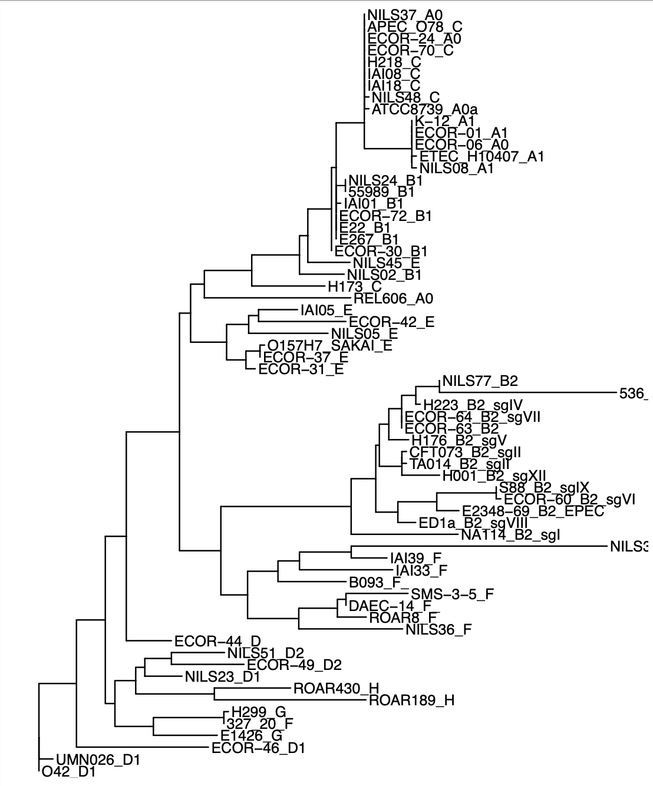

# Making phylogenetic trees
Find orthologue genes with Blastn (command line) and generate a phylogenetic tree (R).

## Starting files and folders
Set up a `data` **folder** containing the following folders and files:
- `Genomes`: **folder** containing `.fasta` files for all the strain of interest, e.g. all E. Coli strains of interest
- `BLAST`: **folder** where all the Blastn results will be stored. 
- `Outputs`: **folder** 
- `gene.fna`: nucleotide sequence **file** of the gene used to find orthologue genes in the available species, e.g. a gene common to all E. Coli strains. Fasta files of genes can be downloaded from [NCBI](https://www.ncbi.nlm.nih.gov/).
- `strain_list.txt`: **file** containing a list of the file names contained in the `Genomes folder` (file names are listed without extension and separated by `\n`)

## 1. Install tools 
```
sudo apt install ncbi-blast+
sudo apt-get install phyml
sudo apt-get install mafft
sudo apt install git
git clone https://github.com/inab/trimal.git
cd trimal/source
make
export PATH=$PATH:/home/jc/trimal/source/
```
## 2. Run BLAST
```
# list of strains
strain_names=strain_list.txt

# find the query gene in each strain using blast
for x in `cat $strain_names`
do
  # print strain name
  echo $x

  # blast
  blastn -query gyrA.fasta -subject Genomes/$x.fasta -qcov_hsp_perc 80 -perc_identity 70 -outfmt "6 qseqid sseq" | sed 's/^\(.\{0\}\)/\1>/' | tr '\t' '\n' | sed "s/>.*/>$x/"  > BLAST/$x.fasta

done
```
**Blast command explained:**
- set minimum query coverage per high-scoring pair (HSP) to 80%
- set the minimum percentage identity for a match to 70%
- set BLAST output to contain a query sequence identifier (qseqid) and the subject sequence (sseq)
  
## 3. Multiple sequence alignment
```
# concatenate orthologue sequences into a single file
for x in `cat $strain_names`
do
    echo $x
    cat BLAST/$x.fasta >> concate_ortholog.txt
done

# run multiple alignment with mafft (simultaneously compares all sequences in the input fasta file)
mafft --auto concate_ortholog > aligned_file.aln
```

## 4. Build tree with phyml tool 
Use trimal to convert aln file to phy file (compatible with phyml tree buildin tool)
```
trimal -in aligned_file.aln -phylip > aligned_file.phy

# build tree 
phyml -i aligned_file.phy -b 100

```
Here, bootstrapping = 100 (as indicated with flag -b), i.e. algorithm will reiterate 100 times to find the optimal tree.
Phyml outputs 4 `.txt` files. 

The tree is: `aligned_file.phy_phyml_tree.txt`. Use this file in R to visualise the tree (see `tree.R`)

## 5. Visualise tree
After reading the Newick tree in R, the tree can be plotted using the function `gtree`, which is part of the `library(treedataverse)`. 



